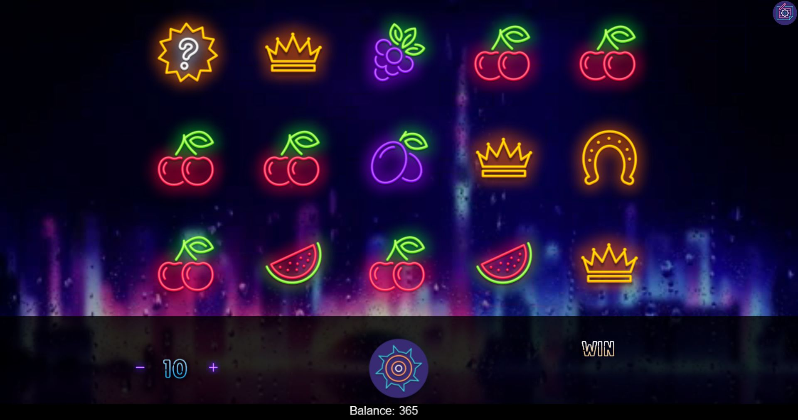

Game | Neon Money Slots

Play to play Neon Money Slots
=============================

In the not-too-distant past, slot-machine players were the second-class citizens of casino customers. Jackpots were small, payout percentages were horrendous, and slot players just weren't eligible for the kind of complimentary bonuses -- free rooms, shows, meals -- commonly given to table players. But in the last few decades the face of the casino industry has changed. Nowadays more than 70 percent of casino revenues comes from slot machines, and in many jurisdictions, that figure tops 80 percent.

About 80 percent of first-time visitors to casinos head for the slots. It's easy -- just drop coins into the slot and push the button or pull the handle. Newcomers can find the personal interaction with dealers or other players at the tables intimidating -- slot players avoid that. And besides, the biggest, most lifestyle-changing jackpots in the casino are offered on the slots.

The following article will tell you everything you need to know about slots, from the basics to various strategies. We'll start at square one, with a primer on how playing slot machines works.

How to Play Online Slots
------------------------

The most popular slots are penny and nickel video games along with quarter and dollar reel-spinning games, though there are video games in 2-cent, 10-cent, quarter, and dollar denominations and reel spinners up to $100. Most reel spinners take up to two or three coins at a time while video slots can take 45, 90, and even 500 credits at a time.

Nearly all slot machines are fitted with currency acceptors -- slide a bill into the slot, and the equivalent amount of credits is displayed on a meter. On reel-spinning slots, push a button marked "play one credit" until you've reached the number of coins you wish to play. Then hit the "spin reels" button, or pull the handle on those few slots that still have handles, or hit a button marked "play max credits," which will play the maximum coins allowed on that machine.

On video slots, push one button for the number of paylines you want to activate, and a second button for the number of credits wagered per line. One common configuration has nine paylines on which you can bet 1 to 5 credits. Video slots are also available with 5, 15, 20, 25, even 50 paylines, accepting up to 25 coins per line.

Many reel-spinning machines have a single payout line painted across the center of the glass in front of the reels. Others have three payout lines, even five payout lines, each corresponding to a coin played. The symbols that stop on a payout line determine whether a player wins. A common set of symbols might be cherries, bars, double bars (two bars stacked atop one another), triple bars, and sevens.

A single cherry on the payout line, for example, might pay back two coins; the player might get 10 coins for three of any bars (a mixture of bars, double bars, and triple bars), 30 for three single bars, 60 for three double bars, 120 for three triple bars, and the jackpot for three sevens. However, many of the stops on each reel will be blanks, and a combination that includes blanks pays nothing. Likewise, a seven is not any bar, so a combination such as bar-seven-double bar pays nothing.

Video slots typically have representations of five reels spinning on a video screen. Paylines not only run straight across the reels but also run in V's, upside down V's, and zigs and zags across the screen. Nearly all have at least five paylines, and most have more -- up to 50 lines by the mid-2000s.

In addition, video slots usually feature bonus rounds and "scatter pays." Designated symbols trigger a scatter pay if two, three, or more of them appear on the screen, even if they're not on the same payline.

Similarly, special symbols will trigger a bonus event. The bonus may take the form of a number of free spins, or the player may be presented with a "second screen" bonus. An example of a second screen bonus comes in the long-popular WMS Gaming Slot "Jackpot Party." If three Party noisemakers appear on the video reels, the reels are replaced on the screen with a grid of packages in gift wrapping. The player touches the screen to open a package and collects a bonus payout. He or she may keep touching packages for more bonuses until one package finally reveals a "pooper," which ends the round. The popularity of such bonus rounds is why video slots have become the fastest growing casino game of the last decade.

When you hit a winning combination, winnings will be added to the credit meter. If you wish to collect the coins showing on the meter, hit the button marked "Cash Out," and on most machines, a bar-coded ticket will be printed out that can be redeemed for cash. In a few older machines, coins still drop into a tray.

Etiquette for playing slots online
----------------------------------

Many slot players pump money into two or more adjacent machines at a time, but if the casino is crowded and others are having difficulty finding places to play, limit yourself to one machine. As a practical matter, even in a light crowd, it's wise not to play more machines than you can watch over easily. Play too many and you could find yourself in the situation faced by the woman who was working up and down a row of six slots. She was dropping coins into machine number six while number one, on the aisle, was paying a jackpot. There was nothing she could do as a passerby scooped a handful of coins out of the first tray.

Sometimes players taking a break for the rest room will tip a chair against the machine, leave a coat on the chair, or leave some other sign that they'll be back. Take heed of these signs. A nasty confrontation could follow if you play a machine that has already been thus staked out.

### Online Slots Payouts

Payout percentages have risen since the casinos figured out it's more profitable to hold 5 percent of a dollar than 8 percent of a quarter or 10 percent of a nickel. In most of the country, slot players can figure on about a 93 percent payout percentage, though payouts in Nevada run higher. Las Vegas casinos usually offer the highest average payouts of all -- better than 95 percent. Keep in mind that these are long-term averages that will hold up over a sample of 100,000 to 300,000 pulls.

In the short term, anything can happen. It's not unusual to go 20 or 50 or more pulls without a single payout on a reel-spinning slot, though payouts are more frequent on video slots. Nor is it unusual for a machine to pay back 150 percent or more for several dozen pulls. But in the long run, the programmed percentages will hold up.

The change in slots has come in the computer age, with the development of the microprocessor. Earlier slot machines were mechanical, and if you knew the number of stops -- symbols or blank spaces that could stop on the payout line--on each reel, you could calculate the odds on hitting the top jackpot. If a machine had three reels, each with ten stops, and one symbol on each reel was for the jackpot, then three jackpot symbols would line up, on the average, once every 10310310 pulls, or 1,000 pulls.

On those machines, the big payoffs were $50 or $100--nothing like the big numbers slot players expect today. On systems that electronically link machines in several casinos, progressive jackpots reach millions of dollars.

The microprocessors driving today's machines are programmed with random-number generators that govern winning combinations. It no longer matters how many stops are on each reel. If we fitted that old three-reel, ten-stop machine with a microprocessor, we could put ten jackpot symbols on the first reel, ten on the second, and nine on the third, and still program the random-number generator so that three jackpot symbols lined up only once every 1,000 times, or 10,000 times. And on video slots, reel strips can be programmed to be as long as needed to make the odds of the game hit at a desired percentage. They are not constrained by a physical reel.

Each possible combination is assigned a number, or numbers. When the random-number generator receives a signal -- anything from a coin being dropped in to the handle being pulled -- it sets a number, and the reels stop on the corresponding combination.

Between signals, the random-number generator operates continuously, running through dozens of numbers per second. This has two practical effects for slot players. First, if you leave a machine, then see someone else hit a jackpot shortly thereafter, don't fret. To hit the same jackpot, you would have needed the same split-second timing as the winner. The odds are overwhelming that if you had stayed at the machine, you would not have hit the same combination.

Second, because the combinations are random, or as close to random as is possible to set the program, the odds of hitting any particular combination are the same on every pull. If a machine is programmed to pay out its top jackpot, on the average, once every 10,000 pulls, your chances of hitting it are one in 10,000 on any given pull. If you've been standing there for days and have played 10,000 times, the odds on the next pull will still be one in 10,000. Those odds are long-term averages. In the short term, the machine could go 100,000 pulls without letting loose of the big one, or it could pay it out twice in a row.

So, is there a way to ensure that you hit it big on a slot machine? Not really, but despite the overriding elements of chance, there are some strategies you can employ. We'll cover these in the next section.

### Casino Slot Machine Myths

Because most players do not understand how slot machines work, whole sets of beliefs have grown over when to play a machine and when to avoid it. Little truth is in any of them. Here's a look at some of the more pervasive slot myths:

**Change machines after a big jackpot -- the machine won't be due to hit again for some time.** From a money-management standpoint, it makes sense to lock up the profits from a big hit and move on. But the machine is not "due" to turn cold. In fact, the odds against the same jackpot hitting on the next pull are the same as they were the first time.

**Play a machine that has gone a long time without paying off -- it is due to hit.** Slot machines are never "due." Playing through a long losing streak all too frequently results in a longer losing streak.

**Casinos place "hot" machines on the aisles.** This belief is so widespread that end machines get a good deal of play regardless of how they pay. It is true that not all machines in the same casino are programmed with the same payback percentage. And it's true that casinos want other customers to see winners. But slot placement is more complex than just placing the hot ones at the ends of aisles.

**The payback percentage is lowered when the crowds are bigger and demand is greater.** It's not that easy to change a machine's programming. Changing the programmed payback percentage requires opening the machine and replacing a computer chip. That's not something to do cavalierly.

Online Casino Slot Machine Strategies
-------------------------------------

Slots are the easiest games in the casino to play -- spin the reels and take your chances. Players have no control over what combinations will show up or when a jackpot will hit. There is no way to tell when a machine will be hot or cold. Still, there are some pitfalls. It's important to read the glass and learn what type of machine it is. The three major types of reel-spinning slots are the multiplier, the buy-a-pay, and the progressive.

**The multiplier.** On a multiplier, payoffs are proportionate for each coin played--except, usually, for the top jackpot. If the machine accepts up to three coins at a time, and if you play one coin, three bars pay back ten. Three bars will pay back 20 for two coins and 30 for three coins. However, three sevens might pay 500 for one coin and 1,000 for two, but jump to 10,000 when all three coins are played. Read the glass to find out if that's the case before playing less than the maximum coins on this type of machine.

**The buy-a-pay.** Never play less than the maximum on a buy-a-pay, on which each coin "buys" a set of symbols or a payout line. The first coin in might allow the player to win only on cherry combination, while the second coin activates the bar payouts, and the third coin activates the sevens. Woe is the player who hits three jackpot symbols on a buy-a-pay with only one coin played--the player gets nothing back. A variation is the machine with multiple payout lines, each activated by a separate coin. All symbols are active with each coin, but if a winning combination lines up on the third-coin payout line with only one or two coins played, the payoff is zero.

**The progressive.** You also have no reason to play less than maximum coins on a progressive machine. A player who eventually lines up the jackpot symbols gets a percentage of each coin played. The first progressive machines were self-contained--the jackpot was determined by how much that particular machine had been played since the last big hit. Today most progressives are linked electronically to other machines, with all coins played in the linked machines adding to a common jackpot.

These jackpots can be enormous -- the record is $39,710,826.26, a $1 progressive at a Las Vegas casino. The tradeoff is that frequency and size of other payouts are usually smaller. And you can't win the big jackpot without playing maximum coins.

If you must play fewer than maximum coins, look for a multiplier in which the final-coin jump in the top jackpot is fairly small. Better yet, choose a machine that allows you to stay within your budget while playing maximum coins. If your budget won't allow you to play maximum coins on a $1 machine, move to a quarter machine. If you're not comfortable playing three quarters at a time, move to a two-quarter machine. If you can't play two quarters at a time, play a nickel machine.

With so many paylines and the possibility of betting multiple coins per line, video slots are different. Some penny slots with 20 paylines take up to 25 coins per line. That's a $5 maximum bet -- a pretty penny indeed! Most players bet less than the max on video slots but are sure to cover all the paylines, even if betting only one coin per line. You want to be sure to be eligible for the bonus rounds that give video slots most of their fun. Some progressive jackpots require max coins bets, and some don't. If a max-coins bet is required to be eligible for the jackpot and you're not prepared to roll that high, find a different machine.

### Money Management at Online Casino

Managing your money wisely is the most important part of playing any casino game, and also the most difficult part of playing the slots. Even on quarter machines, the amount of money involved runs up quickly. A dedicated slot player on a machine that plays off credits can easily get in 600 pulls an hour. At two quarters at a time, that means wagering $300 per hour -- the same amount a $5 blackjack player risks at an average table speed of 60 hands per hour.

Most of that money is recycled from smaller payouts--at a casino returning 93 percent on quarter slots, the expected average loss for $300 in play is $21. Still, you will come out ahead more often if you pocket some of those smaller payouts and don't continually put everything you get back into the machine.

One method for managing money is to divide your slot bankroll for the day into smaller-session bankrolls. If, for example, you've taken $100 on a two-and-a-half-hour riverboat cruise, allot $20 for each half-hour. Select a quarter machine -- dollar machines could devastate a $100 bankroll in minutes -- and play the $20 through once. If you've received more than $20 in payouts, pocket the excess and play with the original $20. At the end of one half-hour, pocket whatever is left and start a new session with the next $20.

If at any point the original $20 for that session is depleted, that session is over. Finish that half-hour with a walk, or a snack, or a drink until it is time for a new session. Do not dip back into money you've already pocketed.

That may seem rigid, but players who do not use a money management technique all too frequently keep pumping money into the machine until they've lost their entire bankroll. The percentages guarantee that the casino will be the winner in the long run, but lock up a portion of the money as you go along, and you'll walk out of the casino with cash on hand more frequently.

That is changing in new server-based slots that have started to appear in casinos. Operators will be able to change payback percentages at the click of a mouse, but they still must have regulatory approval to do so.

There is a lot more to slot machines than meets the eye. But if you learn the ins and outs of playing them, you can use some strategies that just might help you hit the jackpot.

### Online Slot Machines of the Future

The lifespan of slot games has changed in the video slot age. Because the popularity of video games can peak and decline within a matter of months, casino operators who wanted to offer their customers the latest video slots had to spend a lot of time changing their machines one at a time. Further aggravating this process, most states required the presence of a gaming board agent when the evidence tape was broken, the old game chip taken out, a new chip put in and resealed in the evidence tape, and the machine closed and the paperwork done.

That's changing with the advent of downloadable and server-based games. Nearly every major slot machine manufacturer showed server-based slot machines to the casino industry at the 2005 Global Gaming Expo in Las Vegas. By the spring of 2006, such games were getting trials in Nevada and California.

With server-based systems, a game theme can change instantly. A dollar game can become a penny game. And it can be done with whole banks of machines at once, not just one machine at a time.

One slot manufacturer's system shows a diagram of the casino floor. With a click and drag of a computer mouse, the operator can highlight the games to change. Then with the click of a mouse on a pull-down menu, he or she can select a new game theme, number of paylines, coin denomination, and payback percentage. Voila. New games.

Apply that to a bank of, say, 12 machines, and the effect is amazing. One minute, 12 nine-line nickel slots, the next minute, 12 twenty-line penny slots.

To some extent, it will allow operators to tailor their game offerings to player preference. More and more, casinos are using electronic data warehouses and analytical software to track who's playing, and when. Combine that ability with server-based games, and a casino can change accordingly when it knows that it gets strong penny play during daylight hours but has people waiting for nickel games at night or that video players fill the games on weekdays while other players are crowding low-limit video slots on weekends.

Just as video slots and payoffs by bar-coded tickets have revolutionized the slot floor in the last decade, you can look for server-based games to give casinos another overhaul in the coming years. It won't be long, and the process has already begun.

### Play Online Slot Machines FAQ

#### Is there a secret to slot machines?

Not really, but despite the overriding elements of chance, there are some strategies you can employ.

#### How do you play slot machine games?

The equivalent amount of credits is displayed on a meter. On reel-spinning slots, push a button marked "play one credit" until you've reached the number of coins you wish to play. Then hit the "spin reels" button, or pull the handle on those few slots that still have handles, or hit a button marked "play max credits," which will play the maximum coins allowed on that machine.

#### How much does it cost to play on slot machines?

The most popular slots are penny and nickel video games along with quarter and dollar reel-spinning games, though there are video games in 2-cent, 10-cent, quarter, and dollar denominations and reel spinners up to $100.

#### What happens if you win?

When you hit a winning combination, winnings will be added to the credit meter. If you wish to collect the coins showing on the meter, hit the button marked "Cash Out," and on most machines, a bar-coded ticket will be printed out that can be redeemed for cash.

#### Are there free slots that pay real money?

No, but you can earn bonuses. The bonus may take the form of a number of free spins, or the player may be presented with a "second screen" bonus.

{"@context":"https://schema.org","@type":"WebSite","@id":"#website","url":"https://neon-money-slots.online","name":"Neon Money Slots","description":"Slot machines, also known as fruit machines, pokies, or one-armed bandits, are popular gambling devices found in casinos, bars, and even online platforms. These captivating machines have a rich history and have evolved significantly since their inception.","keywords":"casino slots game, slot-machine, online slots, slot machine game","about":"Slot machines, also known as fruit machines, pokies, or one-armed bandits, are popular gambling devices found in casinos, bars, and even online platforms. These captivating machines have a rich history and have evolved significantly since their inception.","image":"https://neon-money-slots.online/logo.png","sourceOrganization":{"@type":"Organization","url":"https://neon-money-slots.online","name":"WEST OPT","description":"Slot machines, also known as fruit machines, pokies, or one-armed bandits, are popular gambling devices found in casinos, bars, and even online platforms. These captivating machines have a rich history and have evolved significantly since their inception.","image":"https://neon-money-slots.online/assets/img/favicon/favicon512.png","logo":{"@type":"ImageObject","url":"https://neon-money-slots.online/assets/img/favicon/favicon512.png","width":"512","height":"512"}}}{"@context":"https://schema.org","@type":"Organization","url":"https://neon-money-slots.online","name":"WEST OPT","description":"Slot machines, also known as fruit machines, pokies, or one-armed bandits, are popular gambling devices found in casinos, bars, and even online platforms. These captivating machines have a rich history and have evolved significantly since their inception.","image":"https://neon-money-slots.online/assets/img/favicon/favicon512.png","logo":{"@type":"ImageObject","url":"https://neon-money-slots.online/assets/img/favicon/favicon512.png","width":"512","height":"512"}}
